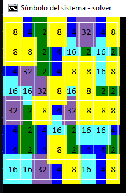

# Exponentile Solver

Golang engine that solves the game Exponentile: https://www.bellika.dk/exponentile

The game is played on an 8x8 board by swapping contiguous tiles. When three or more tiles with the same value line up, they combine into a single tile bearing the next power of two (2, 4, 8, 16, ...).



The game becomes harder as more numbers appear on the board, making it increasingly difficult to line up 3 or more tiles with the same value.

See the detailed rules in the [Game Mechanics wiki page](https://github.com/victor-ferrer/exponentile-solver/wiki/Game-Mechanics).

## How to run the game

**Build:**
```bash
go build .\solver.exe
```

**Or run directly:**
```bash
go run main.go
```

**Gameplay:**
1. Once the board appears, hit Enter.
2. Select two tiles to swap them.
3. Valid swaps that create groups of 3+ matching tiles will merge them.
4. Hit ESC to exit the game.

## Project Status

### Completed Features ✅

**Board Operations:**
- ✅ Swap tiles
- ✅ Drop tiles that match
- ✅ Get groups of tiles (supports 3+ tiles, horizontal and vertical runs)
- ✅ Calculate scores of removed tiles
- ✅ Reevaluate the board once a group is gone (detect cascading matches)
- ✅ Bigger groups return higher new tiles

**Infrastructure:**
- ✅ Tests with GitHub Actions
- ⏳ Releases with GitHub Actions (planned)
- ⏳ Linters on CI pipeline (planned)

**UI:**
- ✅ Basic CLI interface using TVIEW

### Future Plans

The interesting part, rather than just copying the game, would be to have several solving strategies and see which one performs better.

**Implement solving strategies:**
- Top-bottom, bottom-top, random, etc.
- Benchmark: score after N moves, maximum score before game end, execution time
- GitHub Actions to post benchmark results

## Technology Stack

- **Language:** Go 1.22
- **CLI UI:** [TVIEW](https://github.com/rivo/tview) for rendering the terminal UI
- **Matrix Operations:** [GoNum](https://github.com/gonum/matrix) matrix package

## Architecture

This project follows Domain-Driven Design principles:

- **Domain Layer** (`domain/` package): Contains core game logic and board operations
- **Event-Based Communication**: Domain communicates via events, not direct calls
- **UI Layer** (`ui/` package): CLI interface implementation (other UIs may be added later)
- **Separation of Concerns**: Domain logic is independent of UI and infrastructure

See [AGENTS.md](AGENTS.md) for detailed development guidelines and game mechanics documentation.
