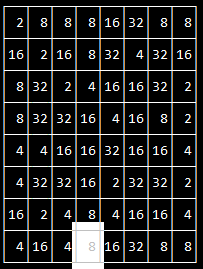

# Exponentile Solver

Golang engine that solves the game Exponentile: https://www.bellika.dk/exponentile

The game is played in a 8x8 board by swapping contiguos tiles. When three or more are lined up, they are combined into a single one bearing the next power of two (2,4,8,16,...).
The game is harder as time passes as more numbers are present in the board and is harded to line 3 of them with the same value.

# Ideas

## Mimic the current game engine (ongoing):

-  Board operations:
 - [x] Swap tiles.
 - [x] Drop tiles that match.
 - [ ] Get groups of tiles.
 - [ ] Calculate scores of the removed tiles.
-  Project infrastructure:
 - [x] Add tests and some Github Actions executing them.
 - [ ] Run linters on the CI pipeline.
-  A UI to play around: 
 - [x] The most basic form of UI to play the game: A CLI. Just for laughs.
 - [ ] Map the basic board operations to the UI.

## Implement some strategies that solve the game (future):
- Top-bottom, bottom-top, random, etc.
- Benchmark the score after a given number of moves, maximum score before game end, execution time, etc.
- Have some Github action that postes the results of such benchmarks.

# Current UI status

Black and White colour schema for now.

# How to run it

Run it with:
- `go run main.go`
- Once the board appears, hit enter and the you can select two tiles in order to swap them. 
- That is for now.

# Stack
- Golang 1.22
- [TVIEW](https://github.com/rivo/tview) for rendering the CLI UI.
- [GoNum](https://github.com/gonum/matrix) matrix package for Golang. 